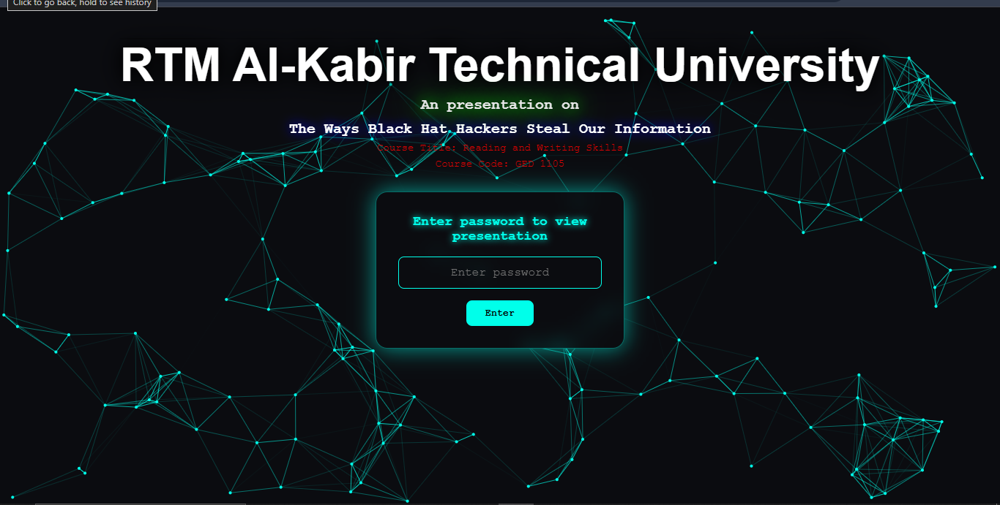
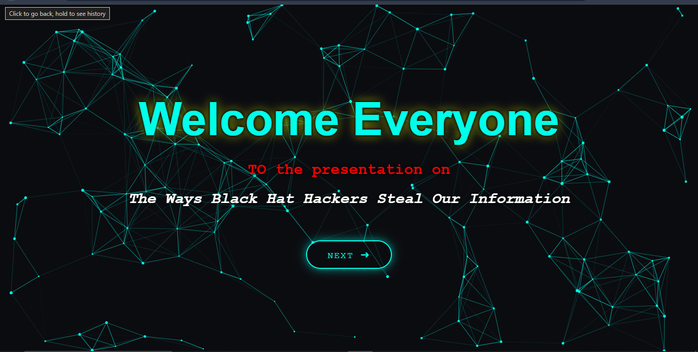
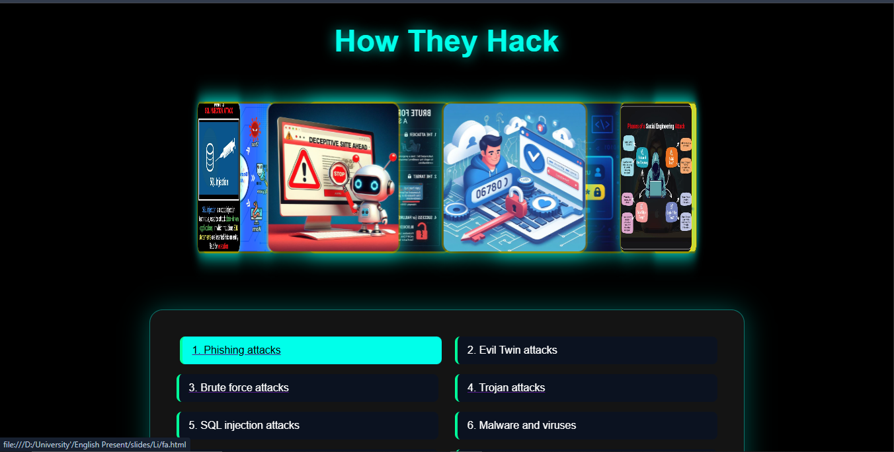
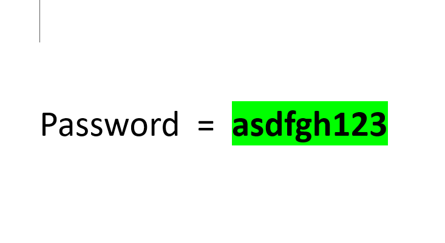

# 🚀 Presentation Web Page

A modern and interactive animated presentation website built using **HTML, CSS, and JavaScript**.  
This project features smooth animations, 3D effects, and an engaging UI design.

---

## ✨ Features

- 🎯 Interactive UI Design
- 🌌 Smooth Animations
- 🧊 3D Effects
- ⚡ Fast & Lightweight
- 📱 Responsive Layout

---

## 📸 Preview

### 🖥️ Home Page


---

### 🎨 Welcome Page


---

### 🧊 3d slide


---

### 📱 3d slide


---
###  Presentation password

## 🛠️ Built With

- HTML5
- CSS3
- JavaScript (Vanilla JS)

---

## 📂 Project Structure

```
|presentation code folder
|
|---html file--------------------- open html file any browser to view
|---js file
|--- slides folder|
                  |---slides1.html
                  |---slide2
                  |---slide3
                            
```
